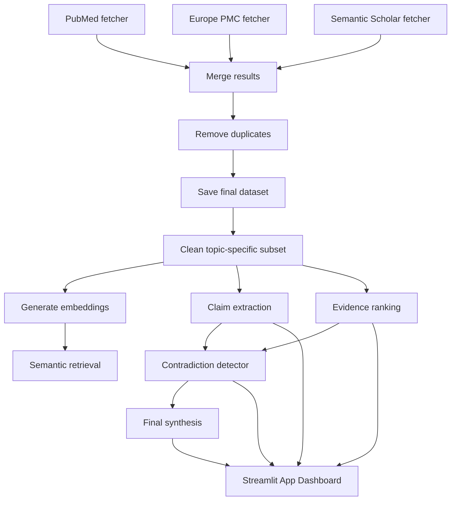

# Metformin and Breast Cancer Paper Pipeline

This project builds a small research dataset around the query **metformin breast cancer**.

It collects papers from three sources, merges and deduplicates them, filters to the topic of interest, generates embeddings, and supports semantic retrieval and claim extraction.

## Pipeline



## Main Scripts

- `build_dataset.py` - runs the full collection and merge pipeline.
- `collect_pubmed.py` - fetches PubMed papers with Entrez.
- `collect_pmc.py` - fetches Europe PMC papers.
- `collect_semanticscholar.py` - fetches Semantic Scholar papers.
- `merge_data.py` - merges source CSVs and removes duplicates.
- `clean_dataset.py` - filters to metformin + breast cancer papers.
- `generate_embeddings.py` - creates sentence embeddings for cleaned papers.
- `retrieval.py` - searches the embedded dataset by semantic similarity.
- `claim_extractor.py` - extracts structured claims using Ollama.
- `evidence_ranker.py` - classifies papers by Oxford Levels of Evidence, extracts sample sizes, and assigns scores.
- `contradiction_detector.py` - identifies contradictions from extracted claims using pairwise LLM comparison.
- `final_synthesis.py` - synthesizes an advanced final report from claims, contradiction records, and evidence quality metrics.
- `app.py` - launches the premium Streamlit interactive web dashboard to visualize findings.

## Setup

Create and activate the virtual environment, then install dependencies:

```powershell
& .\venv\Scripts\Activate.ps1
pip install -r requirements.txt
```

Set required environment variables:

```powershell
$env:ENTREZ_EMAIL = 'your.email@example.com'
$env:SEMANTIC_SCHOLAR_API_KEY = 'your-semantic-scholar-key'
```

## Build the dataset

Run the full pipeline:

```powershell
python build_dataset.py --query "metformin breast cancer" --max-results 100 --run-filter
```

This produces:

- `dataset/pubmed.csv`
- `dataset/pmc.csv`
- `dataset/semantic_scholar.csv`
- `dataset/final_papers.csv`
- `dataset/clean_papers.csv` when `--run-filter` is used

## Generate embeddings

```powershell
python generate_embeddings.py --input dataset/clean_papers.csv --output dataset/clean_papers_with_embeddings.csv --include-title
```

## Search the dataset

```powershell
python retrieval.py --input dataset/clean_papers_with_embeddings.csv --query "metformin breast cancer" --top-k 5
```

## Claim extraction

```powershell
python claim_extractor.py --input dataset/clean_papers.csv --output dataset/claims.csv --limit 50 --save-every 10
```

## Evidence Ranking (Oxford Levels & Sample Size Extraction)

Ranks and updates metadata for papers:

```powershell
python evidence_ranker.py
```

Produces:
- `dataset/ranked_papers.csv` (contains Oxford clinical design labels, sample size extractions, and scaled scores)

## Contradiction detection

The contradiction detector uses a multi-stage pipeline:

1. **Semantic pre-filtering** — embeds claims and selects the most relevant pairs by cosine similarity
2. **Pairwise LLM analysis** — classifies each pair as AGREEMENT / CONTRADICTION / PARTIAL_AGREEMENT / UNRELATED
3. **Evidence-weighted scoring** — integrates evidence quality scores from `evidence_ranker.py`
4. **Cluster & synthesise** — generates a focused synthesis from high-confidence results
5. **Report generation** — outputs JSON, Markdown, plain-text, and CSV reports

Basic usage:

```powershell
python contradiction_detector.py
```

With options:

```powershell
python contradiction_detector.py --max-pairs 20 --similarity-threshold 0.4 --evidence-file dataset/ranked_papers.csv
```

Skip embedding pre-filtering:

```powershell
python contradiction_detector.py --no-embeddings --max-pairs 15
```

Outputs produced:

- `dataset/contradictions.json` — full structured results
- `dataset/contradictions_report.md` — rich Markdown report with tables
- `dataset/contradictions.txt` — plain-text report (backward compatible)
- `dataset/contradictions.csv` — all pairwise results as CSV

## Final Synthesis

Compiles the final advanced markdown and text reports leveraging contradiction outputs and ranked evidence levels:

```powershell
python final_synthesis.py
```

Produces:
- `dataset/final_synthesis.txt` (Plain text report)
- `dataset/final_synthesis.md` (Markdown report)

## Interactive Dashboard UI

Launch the Streamlit app to explore metrics, synthesis summaries, contradictions list, and ranked clinical datasets:

```powershell
streamlit run app.py
```

## Notes

- `venv/` is intentionally ignored and should not be committed.
- The Semantic Scholar collector uses conservative pacing and retries because the API is rate-limited.
- `claim_extractor.py`, `contradiction_detector.py`, and `final_synthesis.py` require a local Ollama instance to be running.
